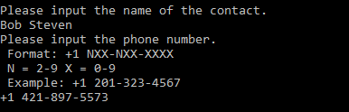

# PhoneBookApp

Fifth console application in a series for learning .net. 

Application allows CRUD actions on the SqlServer (localhost) database.

## Requirements: 
 - [x] This is an application where you should record contacts with their phone numbers.
 - [x] Users should be able to Add, Delete, Update and Read from a database, using the console.
 - [x] You need to use Entity Framework, raw SQL isn't allowed.
 - [x] Your code should contain a base Contact class with {Id INT, Name STRING and Phone Number(STRING)}
 - [x] You should use Code-First Approach, which means EF will create the database for you.
 - [x] You should use SQL Server, not SQLite.

## Features
- Phonebook menu
  - Main menu prompts user to chose one CRUD actins.
  - 

- Contact input prompt
  - User is first prompted to input contact name than number.
  - Validation is adjusted for North American numbers.
  - 

- Reporting
  - All stored contacts are pulled from the SqlServer db.
  - 

- Reporting is done for all the tables with different information
  - "ConsoleTableExt" library was used for table display 

## Tech stack:
- ConsoleTableExt
- EntityFramework
- SqlServer
- SqlClient
- .net 6.0

Special thanks to [Cappuccinocodes](https://github.com/cappuccinocodes) for help and advice.
